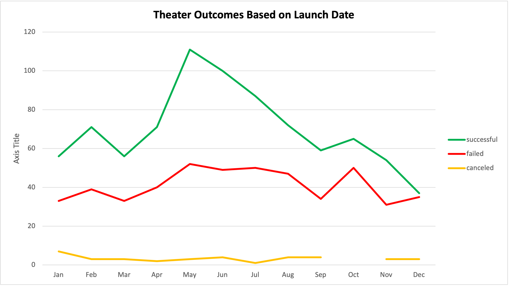
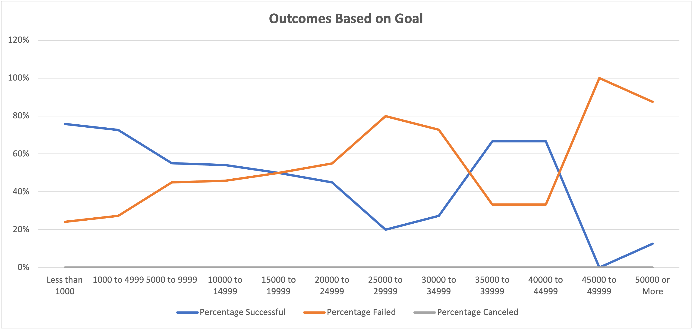

# Kickstarting with Excel

## Overview of Project
  An Analysis was performed on kickstarter data in order to determine how different campaigns performed based on their launch dates and funding goals.
### Purpose
  Louise, a new up and coming play-write, has used a crowd funding campaign in order to fund her new play "fever". After coming close to her fundraising goal, she is curious to know how other similar plays performed on crowd funding sites. 
## Analysis and Challenges 
  Before diving too far into the data, I first glanced through the raw data sheet in order to get an idea of the type of numbers and information that I was dealing with. I filtered the subcategory by plays, and as I was scrolling through I noticed right away that all play campaigns were either successful or has failed, none were cancelled. I then added a column titled "years" and used the 'YEARS()' function on Excel in order to pull the year that the campaigns were created. I saw that most play campaings were created between the years 2014 - 2017. While I did not have any challenges that arrised during my analysis, I could see the 'COUNTIFS()' function in Excel being rather tedious to use, if using it multiple times. I had to pay extra attention to detail when editing my formula in order to make sure that I was staying between the specified goal limits.  
### Analysis of Outcomes Based on Launch Date
  In order to analyze the campaings success based on their launch date, I first needed to create a pivot table. I selected all of the date from the kickstarter sheet and created a pivot table in a new sheet named "Theater Outcomes by Launch Date". I filtered my table based on years and parent category. I set my columns to be the different outcomes and my rows were the Date Created Conversion column from the original kickstarter sheet. I made sure that the rows were organized by month and not year. The values in my table were the count of the different outcomes. I then filtered the parent category to show only the data for theater campaigns. I then created a line graph based on the date from the pivot table. 

### Analysis of Outcomes Based on Goals
  In order to analyze the campaigns outcomes based on their goals, I first created a new sheet titled "Outcomes Based on Goals". I created a column titled "goals" and listed 12 different goals ranges. I then created 3 columns titled "Number of Successful", "Number of Failed", and "Number of Canceled". I used the 'COUNTIFS()' function in excel to find the amount of successful, failed, and canceled, play campaigns that fell in each goal range. I filted the 'COUNTIFS()' function by outcome type, goal range, and plays. I then used the 'SUM()' function in order to sum the amount of successful, failed, and canceled campaigns in each goal range. In order to find the percentage of successful campaigns for each goal range, I divided the number of sucessful campaigns by the total amount of campaigns for each goal range. I then set the column format to percentage so that my numbers were converted to percents. I repeated this process in order to find the percent failed and percent canceled. I then was able to create a line graph using the goal ranges and the percents of successful, failed, and canceled for each. The line graph can be seen below.  

## Results
  By looking at the line graph of the outcomes based on launch date, I was able to tell that theater campaigns had a higher amount of successful campaigns overall than the failed ones. I could also see that the highset count of successful theater campaigns were ones created in May and then June respectively. This might be the best months to begin a campaign. I can also see that the success rate for theater campaigns decreases in the later half of the year, with the worst month to start a theater campaign being December since this is when the count of successful campaigns is almost equal to the count of failed ones.
    The top 3 goal ranges for successful play campaigns was less than $1,000, between $1,000-$4,999, and $35000 - $44,999. In order to ensure that you are more likely to be successful, I would list play campaign goals under $5,000 or between $35,000 - $44,999. The highest goal range for failed campaigns was greater than $45,000. I would not list a play campaign over $45,000 if you want to ensure that you will be successful in meeting your goal.  
